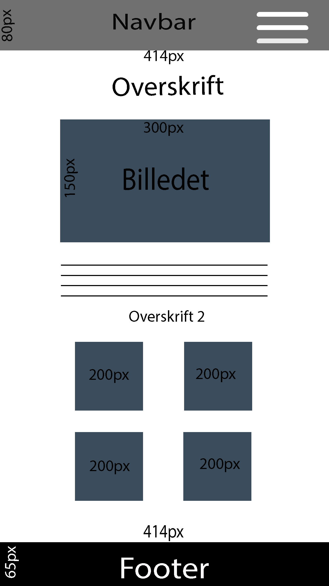
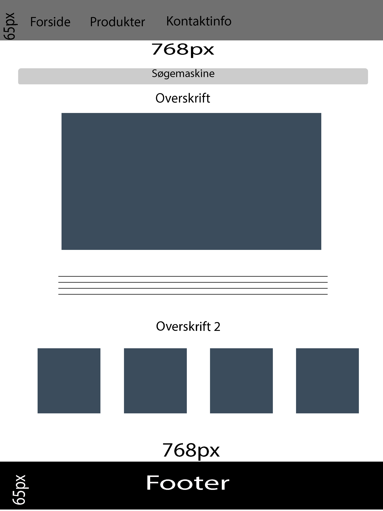

#HIFI Dokumentation

## Dag 1 
Jeg startede med at lave Wireframes til både mobil og ipad, og samtidig også skitser. Lige så stille begyndte jeg at lave koden til min hjemmeside. 

## Wireframe (Mobil)

## Wireframe (Ipad)

## Dag 2
Jeg arbejde videre med HTML og CSS og fik lavede mere omkring de statiske. 

## Dag 3  
Jeg begynde lige så stille at arbejde med min database inde phpMyAdmin, og lavede de første produkter. Også begyndte jeg at lave det javascript indhold vi skal lave. 

## Dag 4 
Jeg fortsatte med at lave videre med javascript, og videre med min database. Det lykkes mig at få det til at fungere, og jeg fortsatte med at lave det. 

## Dag 5 
Jeg fortsatte med at få min server til at fungere, og så at få mine produkter ud på hjemmeside. 

## Dag 6 
Jeg fortsatte med at få min produkter ud på min hjemmeside. 

## Dag 7 
Jeg fortsætter med at få min produkter ud på min hjemmeside, og jeg prøver at få dem sat i orden. 

## Dag 8 
Jeg fik endelig sat alle mine produkter ind. 

## Dag 9 
Jeg gik igang med at lave kontaktvalidering, og jeg brugte en validering som vi havde lavede på GF2 til at få det til at fungere. 

## Dag 10 
Jeg fik lavede min kontakt valiedering, og går lige så stille igang med at lave min søge funktion. 

## Dag 11
Jeg fik lavede videre på min søge funktion, og lavede en færdig så den kunne søge efter produkter man skrev oppe i søge funktion. 

## Dag 12 
Jeg lavede mere omkring min hjemmeside, for at få det til at se bedre ud. Jeg tilføjede font awesome ikoner til navbare. 

## Dag 13
Jeg lavede videre på hjemmesiden. Jeg tilføjede font awesome ikoner til footeren. 

## Dag 14 
Jeg lavede lidt på mine produkter, jeg har trækket ud af min database. Jeg lavede noget baggrundsfarve, og tilføjede margin-bottom så der kom lidt luft mellem dem. 